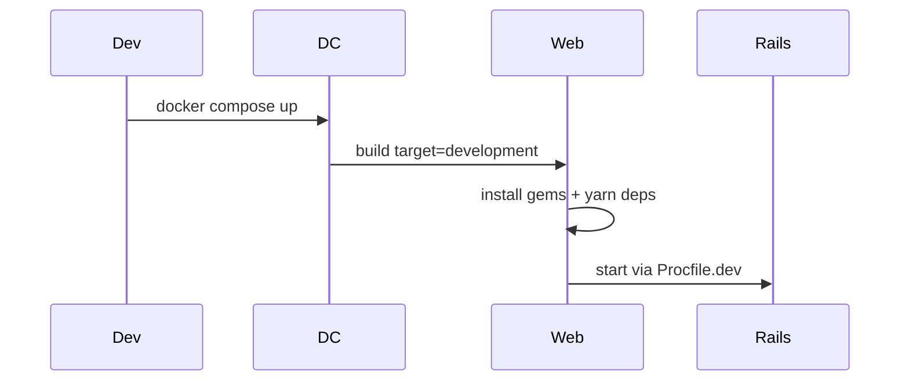
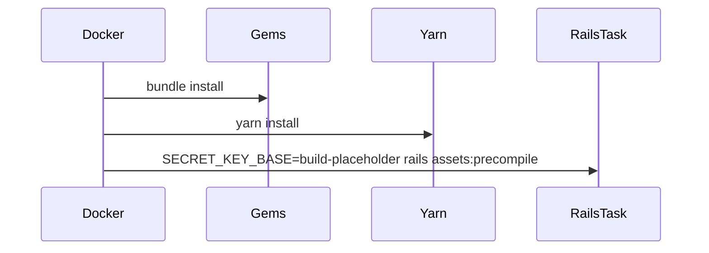

# Phase 11: pnpm-package-manager-migration - Pattern Map

**Mapped:** 2026-05-12
**Files analyzed:** 13
**Analogs found:** 11 / 13

## File Classification

| New/Modified File | Role | Data Flow | Closest Analog | Match Quality |
|-------------------|------|-----------|----------------|---------------|
| `package.json` | config | package-resolution | `package.json` | exact-current-state |
| `pnpm-lock.yaml` | config | package-resolution | `yarn.lock` | role-match |
| `yarn.lock` | config | package-resolution | `yarn.lock` | exact-current-state |
| `Dockerfile` | config | batch | `Dockerfile` | exact-current-state |
| `.semaphore/semaphore.yml` | config | batch | `.semaphore/semaphore.yml` | exact-current-state |
| `README.md` | documentation | request-response | `README.md` | exact-current-state |
| `docs/asset-pipeline.md` | documentation | batch | `docs/asset-pipeline.md` | exact-current-state |
| `bin/yarn` | utility | command-exec | `bin/yarn` | exact-current-state |
| `bin/setup` | utility | batch | `bin/setup` | role-match |
| `bin/update` | utility | batch | `bin/update` | role-match |
| `config/initializers/assets.rb` | config | file-I/O | `config/initializers/assets.rb` | exact-current-state |
| `config/shakapacker.yml` | config | build-config | `config/shakapacker.yml` | review-only analog |
| `.npmrc` | config | package-resolution | none | no-analog |

## Pattern Assignments

### `package.json` (config, package-resolution)

**Analog:** `package.json`

**Manifest metadata pattern** (lines 1-19):
```json
{
  "name": "gala",
  "version": "1.0.0",
  "description": "A platform for the collaborative study of media-rich teaching cases",
  "main": "app/application.js",
  "repository": {
    "type": "git",
    "url": "https://github.com/michigan-sustainability-cases/gala"
  },
  "author": "Cameron L Bothner",
  "license": "MIT",
  "packageManager": "yarn@1.22.22",
  "scripts": {
    "test": "NODE_ENV=test jest app/javascript"
  },
  "engines": {
    "node": ">=24 <25",
    "yarn": "1.x"
  },
```

**Dependency hold pattern** (lines 31-33, 68-75, 99-108):
```json
    "@blueprintjs/core": "4.20.2",
    "@blueprintjs/datetime": "4.4.37",
    "@blueprintjs/select": "4.3.1",
    "react": "^16.8.6",
    "react-dom": "^16.8.6",
    "shakapacker": "10.0.0",
    "webpack": "5.106.1",
    "webpack-cli": "^6.0.1",
```

**Planner copy instruction:** Preserve dependency versions unless the pnpm install exposes a direct missing dependency. Replace only `packageManager` and `engines.yarn` with the pinned pnpm policy from research. Do not treat the current dirty `playwright` addition as Phase 11-owned without an explicit diff decision.

---

### `pnpm-lock.yaml` (config, package-resolution)

**Analog:** `yarn.lock`

**Current lockfile role:** root JavaScript dependency lockfile generated from package metadata. The existing file is too large to quote usefully; use it only as the `pnpm import` source.

**Generation pattern from research:**
```bash
npm view pnpm version time.modified engines --json
corepack enable pnpm
corepack use pnpm@11.1.0
pnpm import
pnpm install
pnpm install --frozen-lockfile
```

**Planner copy instruction:** Generate with `pnpm import` from the current `yarn.lock`, then verify install/build/test parity before committing `pnpm-lock.yaml` and removing `yarn.lock`.

---

### `yarn.lock` (config, package-resolution)

**Analog:** `yarn.lock`

**Dirty diff pattern to respect** (from current git diff):
```diff
+playwright-core@1.59.1:
+  version "1.59.1"
+playwright@^1.59.1:
+  version "1.59.1"
+  dependencies:
+    playwright-core "1.59.1"
```

**Planner copy instruction:** Treat the existing `yarn.lock` diff as pre-existing user work. Phase 11 may delete `yarn.lock` only in the same verified migration that creates `pnpm-lock.yaml`.

---

### `Dockerfile` (config, batch)

**Analog:** `Dockerfile`

**Node and package-manager setup pattern** (lines 21-46):
```dockerfile
# Use the official Node image as a builder source instead of NVM downloads.
COPY --from=node /usr/local/bin/node /usr/local/bin/node
COPY --from=node /usr/local/bin/npm /usr/local/bin/npm
COPY --from=node /usr/local/bin/npx /usr/local/bin/npx
COPY --from=node /usr/local/lib/node_modules /usr/local/lib/node_modules

RUN apt-get update && apt-get install -y --no-install-recommends \
    ca-certificates \
    curl \
    git \
    && ln -sf ../lib/node_modules/npm/bin/npm-cli.js /usr/local/bin/npm \
    && ln -sf ../lib/node_modules/npm/bin/npx-cli.js /usr/local/bin/npx \
    && node --version \
    && npm --version \
    && npm install -g yarn@1.22.22 \
```

**Install/cache layer pattern** (lines 67-76):
```dockerfile
COPY .ruby-version Gemfile Gemfile.lock package.json yarn.lock ./

RUN echo "gem: --no-document" > /etc/gemrc \
    && gem install bundler:2.4.19 \
    && bundle config set build.sassc --disable-march-tune-native \
    && bundle install --jobs 20 --retry 2 \
    && yarn install --check-files \
    && rm -rf ~/.bundle/ $BUNDLE_PATH/ruby/*/cache $BUNDLE_PATH/ruby/*/bundler/gems/*/.git \
    && gem cleanup all \
    && bundle exec bootsnap precompile --gemfile
```

**Build parity pattern** (lines 83-87):
```dockerfile
RUN if [ "$RAILS_ENV" != "development" ]; then \
    export DATABASE_URL=postgresql://placeholder/placeholder; \
    bundle exec bootsnap precompile app/; \
    SECRET_KEY_BASE=build-placeholder bundle exec rails assets:precompile; \
    fi
```

**Planner copy instruction:** Keep the multi-stage Ruby/Node shape and Rails precompile gate. Replace global Yarn install with Corepack/pnpm setup, copy `pnpm-lock.yaml`, and run `pnpm install --frozen-lockfile`.

---

### `.semaphore/semaphore.yml` (config, batch)

**Analog:** `.semaphore/semaphore.yml`

**Install/cache pattern** (lines 19-46):
```yaml
- name: Bundle & Yarn
  commands:
    - checkout
    - sem-version ruby 4.0.3
    - gem install bundler:2.4.19 --no-document
    - cache restore gems-$SEMAPHORE_GIT_BRANCH-$(checksum Gemfile.lock)
    - bundle install
    - cache store gems-$SEMAPHORE_GIT_BRANCH-$(checksum Gemfile.lock) vendor/bundle
    - sem-version node 24.15.0
    - cache restore node-modules-$SEMAPHORE_GIT_BRANCH-$(checksum yarn.lock)
    - yarn install --ignore-engines
    - cache store node-modules-$SEMAPHORE_GIT_BRANCH-$(checksum yarn.lock) node_modules
```

**Test pattern** (lines 48-72):
```yaml
prologue:
  commands:
    - checkout
    - sem-version ruby 4.0.3
    - sem-version node 24.15.0
    - cache restore gems-$SEMAPHORE_GIT_BRANCH-$(checksum Gemfile.lock)
    - cache restore node-modules-$SEMAPHORE_GIT_BRANCH-$(checksum yarn.lock)
    - bundle install --deployment --path vendor/bundle
jobs:
  - name: RSpec & Jest
    commands:
      - bundle exec rails assets:precompile
      - bundle exec rspec --exclude-pattern "spec/features/**/*_spec.rb" --format progress --color
      - yarn test
```

**Planner copy instruction:** Preserve Ruby setup and test ordering. Rename Yarn labels, add Corepack/pnpm before install, key cache to `pnpm-lock.yaml`, use `pnpm install --frozen-lockfile`, and change `yarn test` to `pnpm test`.

---

### `README.md` (documentation, request-response)

**Analog:** `README.md`

**Developer setup command pattern** (lines 29-35):
```markdown
#### Using nodenv

1. `nodenv install 24.15.0`
2. `nodenv shell 24.15.0`
3. `npm install yarn`
4. `yarn`
```

**Test and dependency command pattern** (lines 40-45, 69-77, 85-90):
```markdown
- `bundle exec rake test:unit` to run the Ruby tests
- `yarn test` to run the Javascript tests

When you update dependencies be sure to run these commands locally first
- `bundle install --jobs 4` to install Ruby dependencies
- `yarn` to install Javascript dependencies

- `docker compose run web yarn` to install new JS dependencies in the web container
```

**Planner copy instruction:** Keep terse command-list style. Replace Yarn setup with Corepack/pnpm commands and update Docker container examples to `pnpm`.

---

### `docs/asset-pipeline.md` (documentation, batch)

**Analog:** `docs/asset-pipeline.md`

**Build-flow diagram pattern** (lines 16-42, 50-78):
````markdown
## 1. Local build flow


````

````markdown
## 2. Current production build flow


````

**Planner copy instruction:** Update participant names and command labels only where they describe root JavaScript package installation. Keep architecture narrative intact.

---

### `bin/yarn` (utility, command-exec)

**Analog:** `bin/yarn`

**Legacy package-manager binstub pattern** (lines 1-10):
```ruby
#!/usr/bin/env ruby
APP_ROOT = File.expand_path('..', __dir__)
Dir.chdir(APP_ROOT) do
  begin
    exec "yarnpkg", *ARGV
  rescue Errno::ENOENT
    $stderr.puts "Yarn executable was not detected in the system."
    $stderr.puts "Download Yarn at https://yarnpkg.com/en/docs/install"
    exit 1
  end
end
```

**Planner copy instruction:** Prefer removal unless a binstub is needed by Rails tooling. If replacing, follow this small Ruby wrapper shape but call `pnpm` and update error text.

---

### `bin/setup` and `bin/update` (utility, batch)

**Analogs:** `bin/setup`, `bin/update`

**Setup pattern** (`bin/setup` lines 7-20):
```ruby
def system!(*args)
  system(*args) || abort("\n== Command #{args} failed ==")
end

FileUtils.chdir APP_ROOT do
  puts '== Installing dependencies =='
  system! 'gem install bundler --conservative'
  system('bundle check') || system!('bundle install')

  # Install JavaScript dependencies
  # system('bin/yarn')
```

**Update pattern** (`bin/update` lines 15-20):
```ruby
puts '== Installing dependencies =='
system! 'gem install bundler --conservative'
system('bundle check') || system!('bundle install')

# Install JavaScript dependencies
# system('bin/yarn')
```

**Planner copy instruction:** If Phase 11 cleans commented Yarn assumptions, use existing `system!` style and single-quoted Ruby strings. Do not broaden setup/update behavior beyond package-manager command replacement.

---

### `config/initializers/assets.rb` (config, file-I/O)

**Analog:** `config/initializers/assets.rb`

**Asset path pattern** (lines 8-14):
```ruby
# Add additional assets to the asset load path.
# Rails.application.config.assets.paths << Emoji.images_path
# Add Yarn node_modules folder to the asset load path.
Rails.application.config.assets.paths << Rails.root.join('node_modules')
Rails.application.config.assets.paths << Rails.root.join(
  'node_modules/@blueprintjs/icons/lib/css'
)
```

**Planner copy instruction:** Only update the comment from Yarn-specific wording to package-manager-neutral wording. Keep `node_modules` paths unchanged because pnpm still creates a project `node_modules` entrypoint.

---

### `config/shakapacker.yml` (config, build-config)

**Analog:** `config/shakapacker.yml`

**Build integration pattern** (lines 3-18, 39-59):
```yaml
default: &default
  source_path: app/javascript
  source_entry_path: packs
  public_output_path: packs
  cache_path: tmp/cache/shakapacker
  webpack_compile_output: true
  shakapacker_precompile: true
  javascript_transpiler: "babel"
  assets_bundler: "webpack"
  ensure_consistent_versioning: true
  additional_paths: []

development:
  <<: *default
  compile: true

test:
  <<: *default
  compile: true
  public_output_path: packs-test
```

**Planner copy instruction:** Treat as a parity target, not a likely edit. `bundle exec rails assets:precompile` should keep using this config after pnpm install.

## Shared Patterns

### Package-Manager Ownership

**Source:** `package.json`, `Dockerfile`, `.semaphore/semaphore.yml`
**Apply to:** `package.json`, `pnpm-lock.yaml`, `Dockerfile`, `.semaphore/semaphore.yml`, README/docs

```json
"packageManager": "yarn@1.22.22",
"engines": {
  "node": ">=24 <25",
  "yarn": "1.x"
}
```

Replace with exact pnpm ownership after registry recheck. Keep Node `>=24 <25`.

### Build Verification

**Source:** `Dockerfile` lines 83-87 and `.semaphore/semaphore.yml` lines 66-68
**Apply to:** Docker, CI, phase QA

```bash
bundle exec rails assets:precompile
pnpm test
pnpm install --frozen-lockfile
```

Use the same Rails/Shakapacker build path; only package-manager invocation changes.

### Dirty Worktree Protection

**Source:** current `git diff -- package.json yarn.lock`
**Apply to:** `package.json`, `yarn.lock`, generated `pnpm-lock.yaml`

```diff
-    "test": "jest app/javascript"
+    "test": "NODE_ENV=test jest app/javascript"
+    "playwright": "^1.59.1",
```

Phase 11 planning must explicitly decide whether to adopt these pre-existing changes before regenerating lockfiles.

### Infra npm Boundary

**Source:** `.github/workflows/deploy.yml` lines 36-55 and `infra/package.json` lines 1-17
**Apply to:** Exclusion rules for package-manager migration

```yaml
- uses: actions/setup-node@v4
  with:
    node-version: 24.15.0
    cache: npm
    cache-dependency-path: infra/package-lock.json

- name: Install infra dependencies
  working-directory: infra
  run: npm ci
```

Do not convert `infra/` npm or GitHub deploy workflow as part of root pnpm migration.

## No Analog Found

| File | Role | Data Flow | Reason |
|------|------|-----------|--------|
| `.npmrc` | config | package-resolution | No root `.npmrc` exists. Add only if default pnpm layout fails and a concrete setting such as `node-linker=hoisted` is justified by errors. |
| `pnpm-lock.yaml` | config | package-resolution | No existing pnpm lockfile exists. Generate via `pnpm import`; do not hand-edit. |

## Metadata

**Analog search scope:** root manifests, Docker, Semaphore, README, docs, binstubs, Rails asset config, Shakapacker config, infra boundary files.
**Files scanned:** 19 planning/codebase docs plus targeted source/config files.
**Pattern extraction date:** 2026-05-12
**Worktree note:** `package.json` and `yarn.lock` already have uncommitted changes; planner should read and classify those diffs before implementation.
