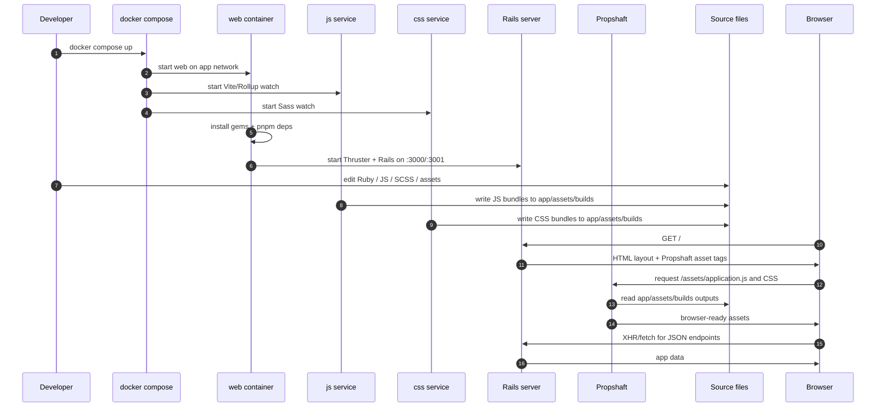
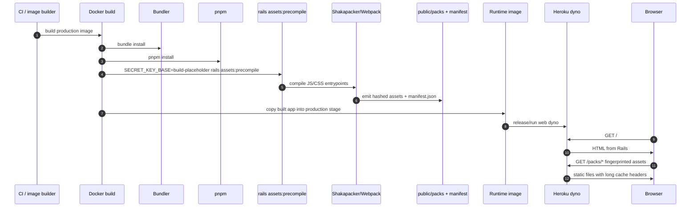
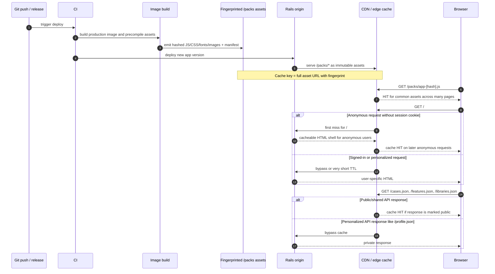
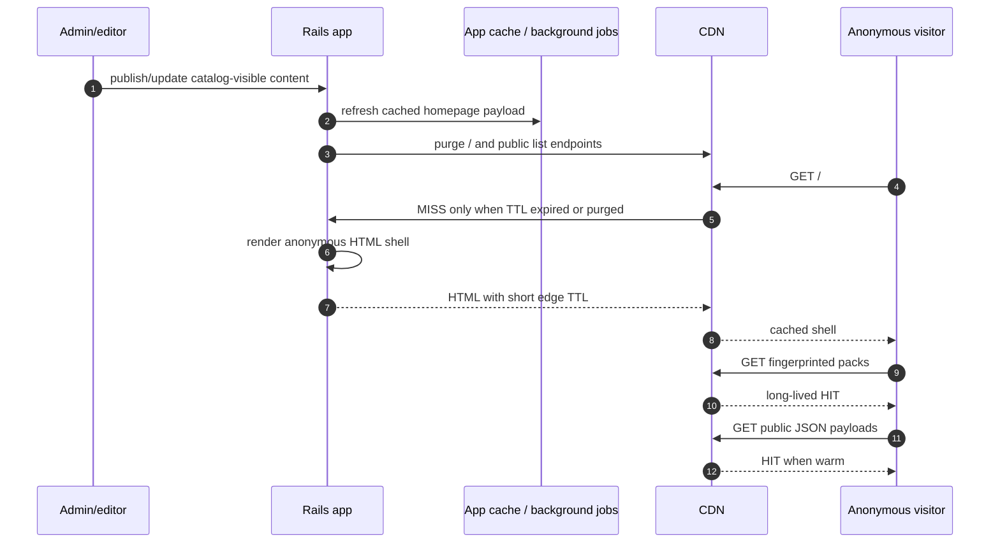

# Asset Pipeline

This document describes how Gala's web bundle is built locally, how it is built for production, and how production deployment should be shaped to maximize CDN cache hits for common pages like `/`.

Repo references:
- `docker-compose.yml`
- `vite.config.mjs`
- `config/initializers/assets.rb`
- `Dockerfile`
- `package.json`
- `config/environments/production.rb`
- `config/routes.rb`
- `app/javascript/application.js`
- `app/assets/stylesheets/application.sass`
- `app/views/layouts/application.html.erb`

Related docs:
- `docs/major-dependency-upgrade-analysis.md`

## 1. Local build flow

Notes:
- Local development runs directly through Docker Compose services:
  `web`, `worker`, `js`, `css`, `db`, and `redis`.
- Rails renders the HTML response and Propshaft serves browser-ready assets from
  `app/assets/builds`.
- The single JavaScript source entry is `app/javascript/application.js`; route
  behavior is loaded through the Rails-aware directory router under
  `app/javascript/routes`.
- The root route `/` is Rails `CatalogController#home`, not a static page.

## 2. Current production build flow

Notes:
- Production assets are precompiled during the Docker build, not on first request.
- `config.assets.compile = false`, so runtime fallback compilation is disabled.
- `public_file_server` serves static files with long-lived cache headers.
- Webpack splits vendor code and runtime chunks so stable shared bundles can stay cacheable across deploys when their content hash does not change.

## 3. Recommended production deploy flow for best CDN hit rate

## 4. What limits CDN hits on `/` today

The main limit is not JS/CSS caching. It is HTML caching for `/`.

Why:
- `/` is rendered by Rails via `CatalogController#home`.
- The home page preloads both public JSON and user-specific JSON like `profile.json`.
- The application layout and header can vary by signed-in state, locale, flash state, and terms-of-service redirect behavior.

That means the safest high-hit CDN strategy is:

1. Keep asset URLs fingerprinted and immutable.
2. Split anonymous HTML from personalized HTML.
3. Cache only the public APIs used by `/`.
4. Normalize the cache key for `/` so anonymous traffic does not vary on full cookie/header sets.
5. Use a short HTML TTL plus stale serving for `/`.
6. Purge `/` and public list endpoints when catalog-visible content changes.

## 5. Practical target architecture

## 6. Deployment recommendations

- Serve fingerprinted assets in `public/packs` with `Cache-Control: public, max-age=31536000, immutable`.
- Keep HTML for anonymous `/` cacheable at the CDN with a short edge TTL such as `s-maxage=300`.
- Use `stale-while-revalidate` and `stale-if-error` on anonymous HTML to improve hit rate without making content too stale.
- Treat authenticated HTML and `profile.json` as private and bypass CDN caching for those responses.
- Mark public catalog APIs as cacheable if they do not depend on session state.
- Purge only route-level HTML and public JSON endpoints on catalog changes; do not purge fingerprinted assets.
