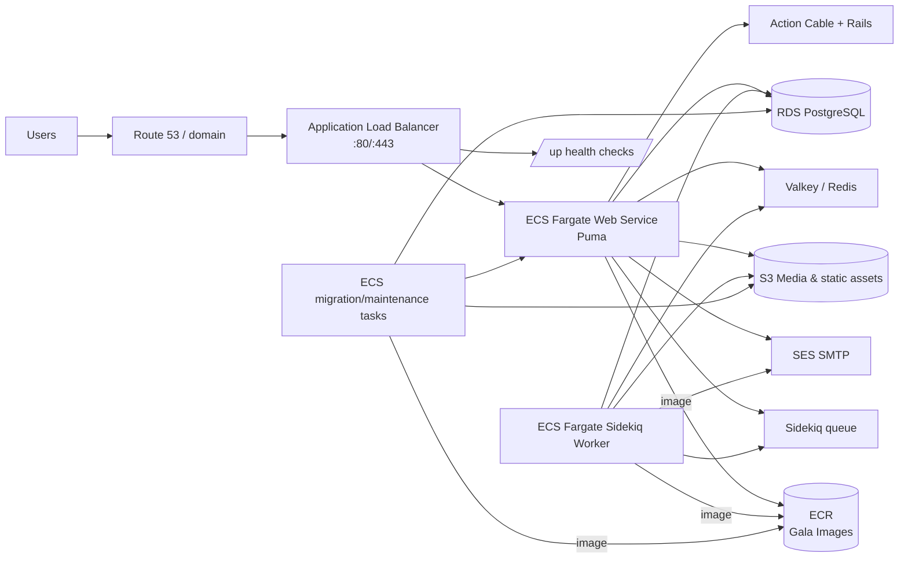

# AWS Gala Production Deployment Operator Runbook

This runbook is for deploying Gala to AWS without touching the existing Heroku production app at `https://www.learngala.com`.

## Deployment model

- Use SST-based AWS infrastructure in `infra/sst.config.ts`.
- Deploy the Rails web container to ECS/Fargate behind a single public ALB.
- Run one Sidekiq worker service and scheduled ECS tasks for maintenance jobs.
- Store app secrets in AWS Secrets Manager and keep runtime assets in S3.
- Keep Heroku only in read-only fallback mode.

## High-level architecture



## Network/security best-practice baseline

- One internet-facing ALB with listeners on `80` and `443`.
- Web/worker/task security groups should allow:
  - Inbound `80/443` to ALB from `0.0.0.0/0` (or via CloudFront if added).
  - Inbound `22` only where SSH management is required (prefer private/admin bastion if possible).
  - Internal traffic between ECS services and database/cache.
- Prefer no public database endpoint exposure.
- RDS and Redis should remain private when possible.
- Route ALB health check path to `/up` with strict timeout/thresholds.
- Use ACM certificates for HTTPS at ALB level.

## Required operator inputs

- AWS profile/environment:
  - `AWS_PROFILE=gala`
  - `AWS_REGION=us-west-2`
- Image naming:
  - `IMAGE_TAG` optional override
- S3 target:
  - default `GALA_STATIC_ASSETS_BUCKET` or `--asset-bucket`
- Optional read-only secrets fallback:
  - `HEROKU_APP_NAME=msc-gala`

## Deployment commands (no Heroku mutation)

### 1) Local safety checks

```bash
bash -n scripts/deploy-gala-aws-production.sh
bash scripts/deploy-gala-aws-production.sh --help
scripts/deploy-gala-aws-production.sh --dry-run --skip-heroku-secret-check --skip-asset-import
```

### 2) Execute deployment (non-Heroku)

```bash
AWS_PROFILE=gala \
AWS_REGION=us-west-2 \
scripts/deploy-gala-aws-production.sh \
  --image-tag "$(git rev-parse --short HEAD)" \
  --asset-bucket gala-static-assets \
  --source-bucket msc-gala \
  --data-dump db/structure.sql
```

### 3) Optional Heroku fallback (read-only only)

```bash
HEROKU_APP_NAME=msc-gala \
AWS_PROFILE=gala \
AWS_REGION=us-west-2 \
scripts/deploy-gala-aws-production.sh --skip-asset-import
```

This path only runs Heroku `config` read commands and never calls:
- `heroku create`
- `heroku git:remote`
- `heroku releases`
- `heroku apps:destroy`

### 4) Verify web endpoint after ECS deployment

Replace `<ALB-DNS>` with the ALB output DNS from this release.

```bash
curl -I "https://<ALB-DNS>/up"
```

## Rollback guidance

1. Revert ECS service to previous healthy image tag using ECS deployment history:
   - update `scripts/deploy-gala-aws-production.sh` tag and redeploy, or
   - ECS console/CLI: rollout with previous task definition revision.
2. If the rollout is broken, switch Service desired image back to the previous ECR tag immediately.
3. Keep deployment artifacts immutable:
  - do not retag deployed release as mutable.
   - use explicit `deploy-<sha>` tags in run records.

## Operational checkpoints

- Confirm ALB DNS responds on `/up` with HTTP 200.
- Confirm Sidekiq queue length and worker health from app logs.
- Confirm object writes/reads in asset bucket.
- Confirm database boot/migration status after first launch.
- Confirm no Heroku destructive action command appears in operator logs.

## Data dump behavior

- Script searches `db/**/*` for `.dump` or `.sql` assets by default.
- If no dump is found, it logs `<none>` and continues with deployment actions that do not require DB import.

## Deployment acceptance criteria

- New ALB route is healthy.
- Asset sync completed without deleting/replacing existing production Heroku resources.
- `scripts/deploy-gala-aws-production.sh` logs resolved target image and bucket.
- Rollback path tested and documented before production traffic increases.
