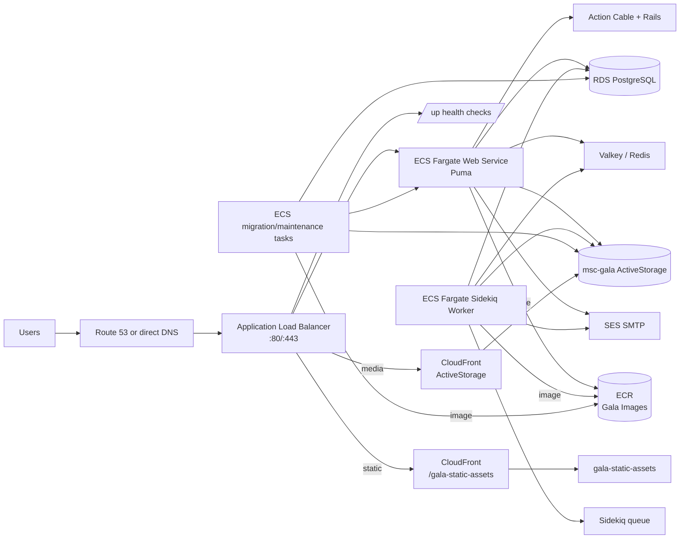

# AWS Gala Production Deployment Operator Runbook

This runbook is for deploying Gala to AWS without touching the existing Heroku production app at `https://www.learngala.com`.

## Deployment model

- Use SST-based AWS infrastructure in `infra/sst.config.ts`.
- Deploy the Rails web container to ECS/Fargate behind a single public ALB.
- Run one Sidekiq worker service and scheduled ECS tasks for maintenance jobs.
- Store app secrets in AWS Secrets Manager and keep runtime assets in S3.
- Keep Heroku only in read-only fallback mode.
- Use the ALB DNS name as `BASE_URL` for this AWS deployment stage.

## High-level architecture



## Network/security best-practice baseline

- Keep one internet-facing ALB with listeners on `80` and `443`.
- Route ALB health checks to `/up` with timeout and failure thresholds aligned to app startup.
- Security group baseline:
  - ALB SG allows inbound `80/443` from internet.
  - ALB SG allows outbound to web SG on `3000`.
  - Web SG allows inbound from ALB SG only on `3000`, outbound to RDS/Valkey, SES, S3, Secrets Manager.
  - Worker SG mirrors outbound needs and has no public inbound by default.
  - SSH (`22`) only where SSH jump host/bastion access is required.
- Prefer no public database endpoint exposure.
- Prefer RDS and Redis in private subnets.
- Use ACM certificates for ALB HTTPS.

## Required operator inputs

- AWS profile/environment:
  - `AWS_PROFILE=gala`
  - `AWS_PROFILW=gala` (legacy typo fallback)
  - `AWS_REGION=us-west-2`
- Image naming:
  - `IMAGE_TAG` optional override
- S3 target:
  - default `GALA_STATIC_ASSETS_BUCKET` or `--asset-bucket`
- Optional read-only secrets fallback:
  - `HEROKU_APP_NAME=msc-gala`
  - `HEROKU_SECRET_PLACEHOLDER` (optional placeholder for missing Heroku config values)
- Optional managed storage/seed settings:
  - `SOURCE_MEDIA_BUCKET` (default `msc-gala`, existing ActiveStorage)
  - `TARGET_MEDIA_BUCKET` (default reuse source or explicit new upload bucket)
  - `GALA_STATIC_ASSETS_BUCKET` (default `gala-static-assets`)
  - `DATABASE_URL` (required for seed restore step)
  - `DATA_DUMP_PATH` (default `db/sqldump/seed.dump`)
  - `AWS_SECRET_PREFIX` (default `gala/production`)

## Deployment commands (no Heroku mutation)

### 1) Local safety checks

```bash
bash -n scripts/deploy-gala-aws-production.sh
bash scripts/deploy-gala-aws-production.sh --help
scripts/deploy-gala-aws-production.sh --dry-run --skip-heroku-secret-check --skip-asset-import
```

### 2) Execute deployment (non-Heroku)

```bash
AWS_PROFILE=gala \
AWS_REGION=us-west-2 \
scripts/deploy-gala-aws-production.sh \
  --image-tag "$(git rev-parse --short HEAD)" \
  --asset-bucket gala-static-assets \
  --source-bucket msc-gala \
  --create-asset-bucket \
  --reuse-source-bucket \
  --seed-database \
  --database-url "$DATABASE_URL" \
  --skip-asset-import
```

### 3) Optional Heroku fallback (read-only only)

```bash
HEROKU_APP_NAME=msc-gala \
AWS_PROFILE=gala \
AWS_REGION=us-west-2 \
scripts/deploy-gala-aws-production.sh --skip-asset-import
```

This path only runs Heroku `config` read commands and never calls:
- `heroku create`
- `heroku git:remote`
- `heroku releases`
- `heroku apps:destroy`

### 4) Full rollback-safe deployment with secret sync and seed restore

```bash
AWS_PROFILE=gala \
AWS_REGION=us-west-2 \
HEROKU_APP_NAME=msc-gala \
AWS_SECRET_PREFIX="gala/production" \
scripts/deploy-gala-aws-production.sh \
  --image-tag "$(git rev-parse --short HEAD)" \
  --asset-bucket gala-static-assets \
  --source-bucket msc-gala \
  --target-media-bucket msc-gala \
  --create-asset-bucket \
  --seed-database \
  --database-url "$DATABASE_URL"
```

Notes:
- `--seed-database` restores from `db/sqldump/seed.dump` unless `--data-dump` is provided.
- `--target-media-bucket` defaults to `SOURCE_MEDIA_BUCKET` for existing ActiveStorage reuse.
- Secret sync reads Heroku values (read-only) for required runtime keys and writes them under `AWS_SECRET_PREFIX/<KEY>` in Secrets Manager.

### 5) Verify web endpoint after ECS deployment

Replace `<ALB-DNS>` with the ALB output DNS from this release.

```bash
curl -I "https://<ALB-DNS>/up"
```

### 6) CloudFront layout for buckets (phase 1)

- Create CloudFront distribution for `gala-static-assets` and point static asset host usage to the distribution domain.
- Create CloudFront distribution for ActiveStorage bucket (`msc-gala` or `TARGET_MEDIA_BUCKET`) and point uploads/downloads through it where possible.
- Use origin access control (OAC) and restrictive cache headers for dynamic content paths.

- Use the compiled asset bucket path only for generated frontend outputs:
  - `public/assets`, `public/packs`, `public/webpack`, `public/fonts`, `public/images`, `public/javascripts`, `public/stylesheets`.

### 7) BASE_URL assignment for ALB-first rollout

- After each run, confirm ALB DNS output and set app `BASE_URL` to:
  - `https://<ALB-DNS>`
- Keep this separate from `https://www.learngala.com` until route cutover is approved.

## Rollback guidance

1. Revert ECS service to previous healthy image tag using ECS deployment history:
   - update `scripts/deploy-gala-aws-production.sh` tag and redeploy, or
   - ECS console/CLI: rollout with previous task definition revision.
2. If the rollout is broken, switch Service desired image back to the previous ECR tag immediately.
3. Keep deployment artifacts immutable:
  - do not retag deployed release as mutable.
   - use explicit `deploy-<sha>` tags in run records.

## Operational checkpoints

- Confirm ALB DNS responds on `/up` with HTTP 200.
- Confirm Sidekiq queue length and worker health from app logs.
- Confirm object writes/reads in asset bucket.
- Confirm object writes/reads in ActiveStorage/media bucket and distribution.
- Confirm database boot/migration status after first launch.
- Confirm no Heroku destructive action command appears in operator logs.
- Confirm secrets are present in Secrets Manager before first request and are referenced by ECS tasks.

## Data dump behavior

- Script searches `db/**/*` for `.dump` or `.sql` assets by default.
- If no dump is found, it logs `<none>` and continues with deployment actions that do not require DB import.

## Deployment acceptance criteria

- New ALB route is healthy.
- Asset sync completed without deleting/replacing existing production Heroku resources.
- `scripts/deploy-gala-aws-production.sh` logs resolved target image and bucket.
- Rollback path tested and documented before production traffic increases.
