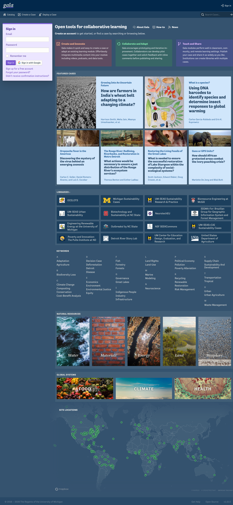
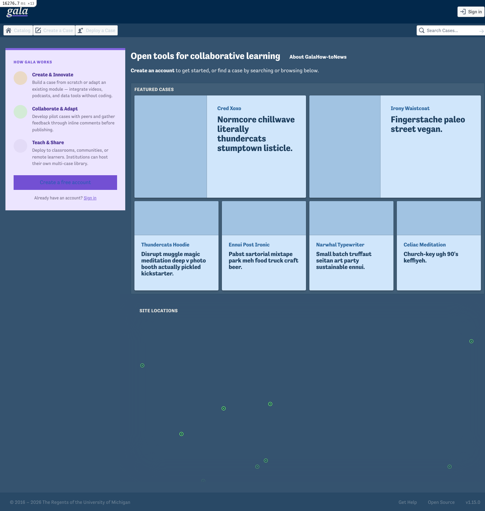
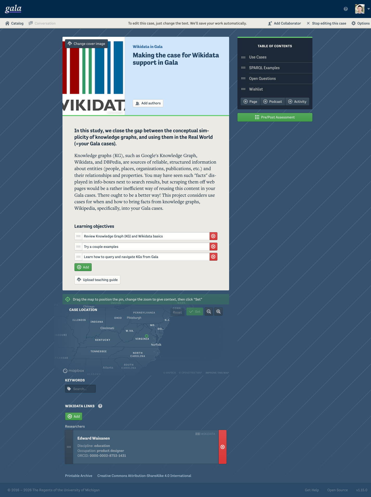
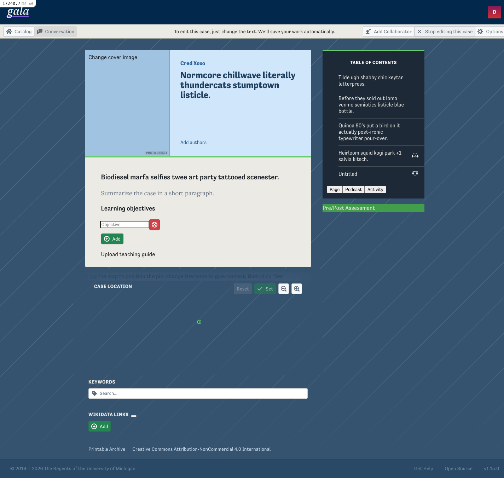
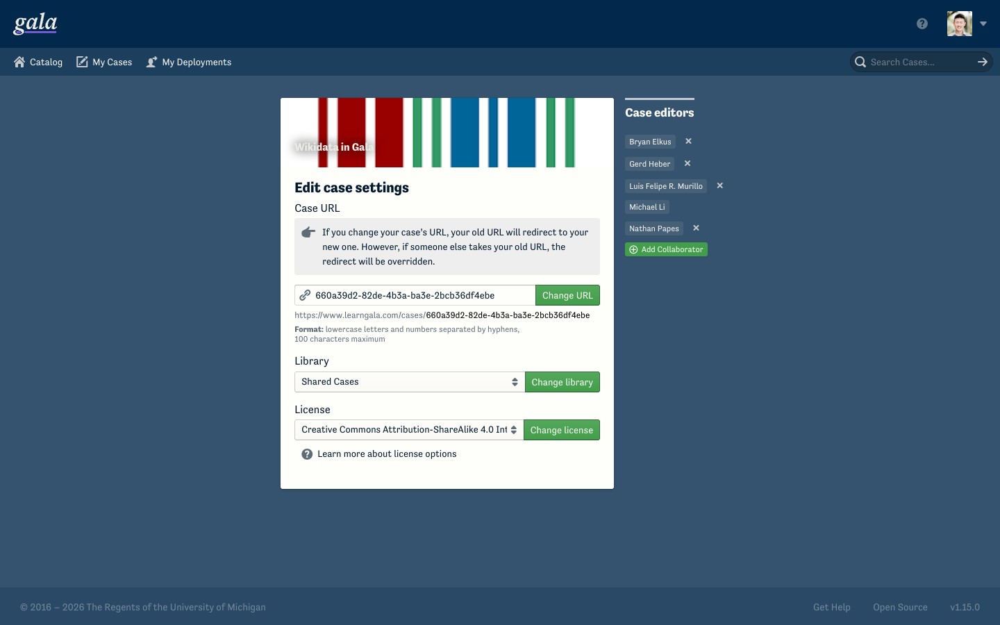
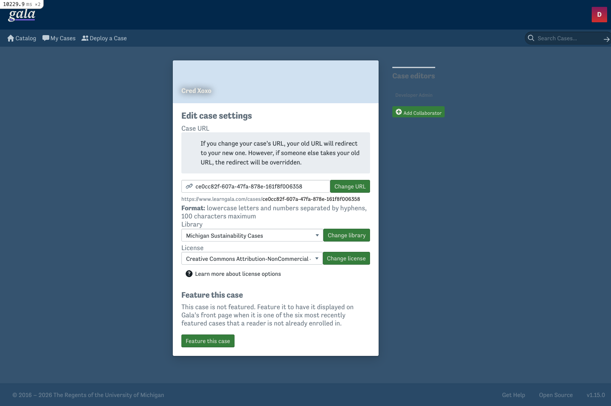

# Blueprint migration — styling audit

**Status:** current as of 2026-06-15 · branch `redesign/catalog-home` · **Blueprint core 6.15.0** (React 19)
**Reference for "correct":** Gala's brand definition (the palette variable block in `app/javascript/shared/blueprint.scss`) and Heroku prod (historically Blueprint 2).

> History: Gala went **Blueprint 2 → 4** (the runtime-shim era, on `infra/sst-aws-poc`), then **4 → 6** with the React 19 upgrade. This audit reflects the **current Blueprint 6** state. An earlier BP4-era version of this report (and its screenshots) lived in the ephemeral `.playwright-mcp/` directory and was wiped — findings preserved here and in agent memory.

---

## 1 · At a glance

The styling breakage is **the Blueprint upgrade, not the Heroku→AWS migration** (local reproduces it). On Blueprint 6 there are **two independent root causes**:

| # | Root cause | Effect | Severity |
|---|---|---|---|
| **A** | **Namespace mismatch** — BP6 styles `bp6-`; the runtime shim still maps `pt-`→`bp4-`; source still emits `pt-`/`bp4-` and **zero `bp6-`** | Hand-authored legacy Blueprint elements (className strings, Rails markup) render **unstyled**; only React Blueprint components (which emit `bp6-`) look right | **HIGH** |
| **B** | **Brand palette not applied** — CSS loaded precompiled; `blueprint.scss` defines Gala's palette vars but never imports Blueprint's Sass | React `bp6-` components render in **stock Blueprint colors** (no Gala purple/green/navy/cream) | **HIGH** |
| **F** | **Icon-font glyphs removed in BP6** — class-based icons (`pt-icon-*`/`bp4-icon-*`) have no CSS in BP6 (icons are React `<Icon>` SVG now) | **172 glyph usages / 72 files render blank** (e.g. "How Gala Works" card) — *not* fixable by renaming to `bp6-` | **HIGH** |

**Verified facts (this session):**
- BP6 package CSS: **999 `bp6-` classes, 0 `pt-`/`bp4-`/`bp5-`**.
- Shim (`blueprintLegacyNamespace.js`): `LEGACY_NAMESPACE='pt-'`, `BLUEPRINT_NAMESPACE='bp4-'` (stale by two majors).
- Source usage: **`pt-` ×1095, `bp4-` ×402, `bp6-` ×0**.
- `blueprint.scss`: palette vars present, **0** Blueprint Sass `@import`s.
- Live local probe: a `pt-button bp4-…` button → transparent, `0px` padding (**unstyled**); a React `bp6-button` → styled (`4px 8px` padding, `4px` radius, bg set). ✓

---

## 2 · Root cause A — namespace mismatch (`bp6-` vs `pt-`/`bp4-`)

Blueprint's CSS namespace is version-stamped: `pt-` (v1/2) → `bp3-` → `bp4-` → `bp5-` → `bp6-`. Gala's migration kept hand-authored `pt-*` classes and added a **runtime shim** that mirrors them to `bp4-` on DOM nodes. That worked under Blueprint 4. Under **Blueprint 6**:

- React Blueprint components emit **`bp6-`** → styled by BP6's CSS. ✅
- Hand-authored **`pt-`** classes → shim adds **`bp4-`** → BP6 CSS styles **neither** → **unstyled**. ❌
- Hand-authored **`bp4-`** classes (from the partial v2→v4 migration) → BP6 CSS doesn't style `bp4-` → **unstyled**. ❌

**Impact:** every element styled via a raw `className` string (e.g. `className="pt-button pt-intent-primary"`) and every server-rendered `.haml`/`.erb` Blueprint element loses its Blueprint styling. React-component-rendered UI is unaffected.

> Note: the `pt-`/`bp4-` rules that *are* present in loaded CSS (≈123 `pt-`, ≈64 `bp4-`) are **Gala's own `blueprint.scss` brand overrides**, not Blueprint's structural CSS — which is why legacy elements get neither structure nor (matching) color.

**Fix A (choose one):**
1. **`BLUEPRINT_NAMESPACE` build define.** Blueprint 6 lets you override its emitted namespace at build time (confirmed `NS = "bp6"` in `@blueprintjs/core/.../common/classes.js`, overridable via the `BLUEPRINT_NAMESPACE` define). Setting it so React emits a namespace matching the existing `pt-`/`bp4-` source avoids the codemod — but you'd also need CSS for that namespace, and BP6 ships no Sass to recompile, so this is less clean than just codemodding to the stock `bp6-`. (Theming/colors are handled separately by Fix B's stylesheet, not here.)
2. **Codemod `pt-`/`bp4-` → `bp6-`** across source (~1497 usages) and retire the shim. Durable but touches many files.
3. **Repoint the shim** to `bp6-` (and mirror `bp4-`→`bp6-`). Fast stopgap; keeps the runtime bridge but only fixes structure, not brand color.

---

## 3 · Root cause B — brand palette not applied to Blueprint 6

`app/assets/stylesheets/application.css` loads Blueprint's **precompiled** CSS (`*= require @blueprintjs/core/lib/css/blueprint`). `blueprint.scss` still *defines* Gala's palette variables but **no longer imports Blueprint's Sass**, so those variables are dead — Blueprint 6 renders in its **stock** palette.

On `main` (Blueprint 2) the same file defined the palette **and** `@import`ed Blueprint's Sass, so Blueprint compiled with Gala's brand. That variable block is the **complete, closed brand definition** — every brand color regression maps to one variable in it (computed values verified against the live BP2 site):

| Sass var | Gala value | Blueprint role | Symptom when un-applied |
|---|---|---|---|
| `$blue2` | `rgb(100,68,187)` | `$pt-link-color` — **all links** | links render stock blue |
| `$blue3` | `rgb(115,80,211)` | `$pt-intent-primary` + focus ring | primary buttons / focus glow stock blue |
| `$blue1` / `$blue5` | `86,63,157` / `156,128,234` | primary active / hover / dark-primary | stock blue variants |
| `$green3` | `rgb(66,158,74)` | `$pt-intent-success` | success buttons stock green |
| `$green1` / `$green5` | `39,124,46` / `108,203,116` | success active / light | stock green variants |
| `$dark-gray1` | `rgb(1,24,45)` | dark-theme bg + `$pt-text-color` | dark surfaces/text neutral, dim toolbar labels |
| `$dark-gray3` | `rgb(26,47,66)` | dark dialog / card surfaces | dialogs navy → gray |
| `$dark-gray5` | `rgb(49,67,84)` | dark elevated surfaces / buttons | dark buttons neutral gray |
| `$gray1` | `rgb(94,108,120)` | `$pt-text-color-muted` | helper-text tint (subtle) |
| `$white` | `rgb(254,254,251)` | cream button text / light surfaces | pure white (subtle) |
| `$light-gray5` | `rgb(250,249,245)` | `$pt-app-background-color` | pure white page bg (subtle) |
| `$orange*` / `$red*` | *(not overridden)* | warning / danger intents | **none** — stock on both, never branded |

The danger/warning row is the proof of completeness: Gala never overrode them, so they look identical before and after — confirming the brand regression set is **exactly** the purple/green/navy/cream-derived colors and nothing else.

**Fix B (spike-verified 2026-06-15):** the v2 "redefine `$blue3`, recompile Blueprint's Sass" path is **gone** — Blueprint 6 ships no consumable Sass theming (CSS-only). Instead BP6 exposes its colors as **CSS custom properties**, and overriding those works. The fix is a small stylesheet (draft: `app/javascript/shared/blueprint-theme.scss`):
- **Intents + focus** → override the semantic tokens `--bp-intent-primary-*` / `--bp-intent-success-*` / `--bp-emphasis-focus-color` at `:root`. *Verified live → `rgb(115,80,211)` / `rgb(66,158,74)` exactly.*
- **Links** → one `a { color: hsl(256,47%,50%) }` rule (BP6 exposes no link token). *Verified → `rgb(100,68,187)`.*
- **Dark surfaces** → a few `.bp6-dark .bp6-*` selector overrides — BP6 **hardcodes** those backgrounds (not token-driven), so custom-property overrides don't reach them.

Key gotcha: **overriding the base palette tokens (`--bp-palette-blue-*`, etc.) does NOT cascade** — BP6's semantic tokens are hardcoded copies, not `var(--bp-palette-*)` references. Override the *semantic* tokens, not the palette. (Warning/danger stay stock — never branded.)

---

## 4 · Findings (Blueprint 6)

### A · Unstyled legacy elements — Root cause A
Any `pt-`/`bp4-`-only element (className-string buttons/inputs/callouts/tags, Rails `.haml`/`.erb` Blueprint markup) renders without Blueprint styling. Confirmed live: `pt-button bp4-…` → transparent, no padding.

### B · Brand colors on React (`bp6-`) components — Root cause B
React Blueprint components render but in stock colors: links blue (not purple), primary blue (not purple), success stock green, focus ring blue, dark surfaces neutral gray (not navy), light surfaces pure white (not cream). See the brand-variable table under "Root cause B" for the exhaustive list.

### C · Code regression — stop-editing button (confirmed on BP6)
`overview/StatusBar.jsx:132` passes a custom className to a toolbar item, tripping the `props.className || 'pt-minimal'` fallback in `utility/Toolbar.jsx:152` and dropping the `minimal` modifier. **Confirmed live on BP6:** the button renders as `bp6-button Toolbar__item--stop-editing` with **no `bp6-minimal`** → solid light-gray fill + gray text (`rgb(93,107,119)`) instead of flat/transparent. Fix: include the minimal class explicitly at the call site.

### D · Admin/settings forms (re-verified on BP6 — render fine)
The settings form is **mostly fine** on BP6 — the white card, selects, green buttons, and callout render correctly because Gala's *own* admin SCSS (`admin-card`, form layout) styles them, not Blueprint structural CSS. (The form has ~46 legacy-only `pt-`/`bp4-` elements, but their lack of Blueprint structure doesn't matter where Gala restyles them.) The one real regression is the dark **"Case editors" sidebar heading**: bright on prod, washed-out gray on BP6 (the same dim-dark-text issue). Deletions/stats pages still warrant a check if they rely on Blueprint structural classes.

### F · Class-based icon-font glyphs removed in Blueprint 6 — HIGH
Blueprint 6 ships icons as React `<Icon>` SVG components only — its icons CSS contains just the `@font-face` declarations and **zero icon classes** (no `.bp6-icon-*`, and of course no `.pt-icon-*`/`.bp4-icon-*`). Any icon rendered via a **className glyph** therefore renders **blank** — no font-family, no glyph. Distinct from Root cause A: renaming to `bp6-` does **not** help (those classes don't exist); the fix is the React `<Icon>` component.

- **Scope:** **172 occurrences across 72 files** use `pt-icon-*`/`bp4-icon-*` glyph classes — all blank on BP6.
- **Visible example:** the "How Gala Works" sign-in card — [`SignInCard.jsx:47`](../app/javascript/catalog/home/SignInCard.jsx#L47) sets `className={` + "`pt-icon-standard pt-icon-${icon} bp4-icon-standard bp4-icon-${icon}`" + `}`. The colored circles render (Gala's own CSS) but the glyphs are gone.
- **Fix:** migrate to `<Icon icon="…">` (SVG); codemod-able for common cases.

### E · Blueprint-6 default cosmetics
Defaults differ again from v4 (e.g. default radius `4px`, modern `color(srgb …)` values). Lower severity; accept or override.

---

## 5 · Fix summary

| Fix | What | Resolves |
|---|---|---|
| **A** | Codemod `pt-`/`bp4-` → `bp6-` + retire the shim (or set the `BLUEPRINT_NAMESPACE` build define so React emits a namespace matching the existing classes) | Root cause A — unstyled legacy elements |
| **B** | CSS custom-property theme stylesheet (`app/javascript/shared/blueprint-theme.scss`): override `--bp-intent-*`/focus tokens, `a { color }` for links, `.bp6-dark .bp6-*` selectors for dark surfaces. **No Sass recompile — BP6 ships none.** | Root cause B — all brand colors |
| **F** | Migrate `pt-icon-*`/`bp4-icon-*` glyphs → `<Icon>` (SVG) | icon-font glyphs blank |
| **C** | One-line `minimal` fix at `StatusBar.jsx:132` | stop-editing button |
| **D** | `bp6-` twins on shim-excluded admin markup | admin/deletions/stats pages |

A (codemod) + B (theme stylesheet) resolve the overwhelming majority of the breakage; the B stylesheet is spike-verified and drafted. C, D, F are smaller follow-ups.

---

## 6 · Visual evidence (BP6 sweep, 2026-06-15)

Screenshots are stored durably in [`docs/blueprint-audit-assets/`](./blueprint-audit-assets/) (not the ephemeral Playwright dir).

**Home — reference vs current** (compare *chrome & color*, not text/images — local seed lacks real cases/cover images/keywords, and its map is a partial Mapbox load):

| Blueprint 2 (prod, correct) | Blueprint 6 (local, current) |
|---|---|
|  |  |

Local BP6 case view: [`bp6-local-case.png`](./blueprint-audit-assets/bp6-local-case.png).

**Case editor — reference vs current:**

| Blueprint 2 (prod, correct) | Blueprint 6 (local, current) |
|---|---|
|  |  |

**Settings form — reference vs current** (renders fine on both; note the dim "Case editors" sidebar heading top-right on BP6):

| Blueprint 2 (prod, correct) | Blueprint 6 (local, current) |
|---|---|
|  |  |

**Live-verified this sweep (computed values on the running apps):**
- **Links (RC-B):** default link color = **`rgb(100,68,187)` Gala purple on BP2 prod** vs **`rgb(33,93,176)` stock blue on BP6 local** ✓ (e.g. "Sign up for a free account").
- **Legacy elements unstyled (RC-A):** a `pt-button bp4-…` button on BP6 local renders transparent with `0px` padding (no Blueprint structure) ✓; a React `bp6-button` renders styled (`4px 8px` padding, `4px` radius) ✓.

## 7 · Verification status & method

- **Verified this session (code + live probe + screenshots):** BP6 namespace, stale shim target, source usage counts, precompiled CSS / dead Sass vars, the unstyled-legacy vs styled-`bp6-` contrast, and the link purple→blue regression — all on the live BP6 build with the BP2 reference.
- **Carried over (still valid, brand definition):** the brand-variable checklist under "Root cause B" (values previously computed and matched against the live BP2 site).
- **Re-verified on BP6 with prod pairs (this sweep, after re-auth):** Finding C (stop-editing renders solid, no `bp6-minimal`); Finding D (settings form renders fine via Gala admin CSS; only the dark sidebar heading dim); editor and settings prod-vs-local screenshot pairs captured. Note: edit mode is entered via the **"Edit this case" toolbar button** (a JS toggle), not `?edit=true`, on the `redesign/catalog-home` branch.
- **Still worth a look:** deletions / stats admin pages (if they rely on Blueprint structural classes rather than Gala's own SCSS).
- **Method (reusable):** per-component `getComputedStyle` fingerprint keyed by normalized class signature, captured on reference + local, diffed programmatically (normalizing known palette shifts so only new/structural diffs surface), then verified with screenshots. Lesson from prior passes: compare **all** properties and verify **pixels** — and scan **all** elements (not just those carrying Blueprint classes; plain `<a>` links are themed via `$pt-link-color`, not a class).

## 8 · CI guardrails (automated)

These findings are now encoded as automated checks so the migration can't silently regress:

- **`tests/visual/blueprint-invariants.spec.mjs`** — content-independent Playwright assertions on the public signed-out home (no auth, baseline-free):
  - links use Gala brand purple `rgb(100,68,187)`, not stock blue
  - primary / success intent buttons use Gala purple / green (injected probe elements)
  - **no class-based icon-font glyphs** (`pt-icon-*`/`bp4-icon-*`) — forces `<Icon>` (catches the "How Gala Works" regression)
  - no legacy `pt-`/`bp4-` element renders unstyled
  - Run locally: `pnpm test:invariants`. Failures are actionable (e.g. *"link color rgb(33,93,176) should be Gala purple rgb(100,68,187)"*). **Currently red on this branch — they go green once Fix A+B and the icon migration land**, then stand guard.
- **Baseline = live production.** `pnpm baseline:from-prod` (`scripts/baseline-from-prod.mjs`) opens `https://www.learngala.com`, measures its actual brand colors, and writes `tests/visual/brand-baseline.json` — which the invariant tests use as their reference (falling back to the committed `blueprint.scss` values if absent). So the answer key *is* "what's live at prod," refreshable on demand and committed for review. It's version-agnostic (the probe carries `pt-`/`bp4-`/`bp6-` classes) and content-independent (injected probe elements). **Caveat:** only valid while prod is the old Blueprint 2 app — after DNS cutover, drop the JSON and let it fall back to the committed `blueprint.scss` brand definition.
- **`.github/workflows/blueprint-invariants.yml`** — runs the spec against a deployed URL (`GALA_BASE_URL`). Dispatchable now; wire into `preview.yml` post-deploy via `uses: ./.github/workflows/blueprint-invariants.yml` with `base_url: <preview_url>`. Cheap (no Rails boot) — complements the heavier screenshot-diff suite (`pnpm test:visual`), whose baselines should be **regenerated from the corrected build** after the fix (the current ones captured the broken state).
- **`playwright.config.mjs`** now honors `GALA_BASE_URL` so any Playwright suite can target a preview deploy.
