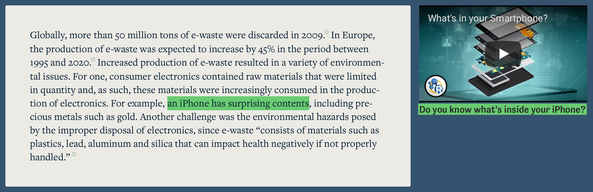
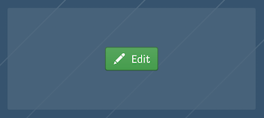
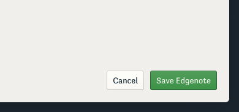
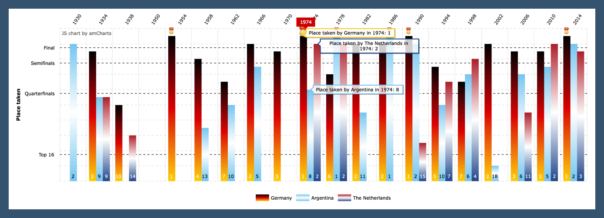
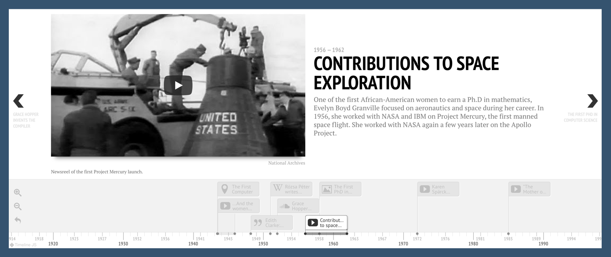
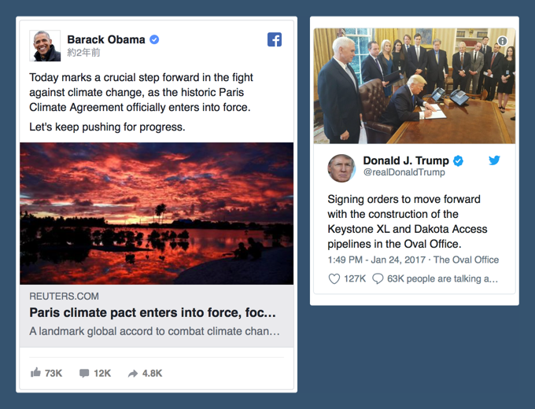

Media is an essential tool in crafting an effective and engaging learning experience.
An embedded element or a highlighted link that comes at the right time can reframe a key concept, relieve mental strain after a necessarily complex segment, or inspire independent research.
Gala makes it easy to include a range of different media elements while keeping the focus on the story you’re telling.

We call these media components **Edgenotes**.
They support images and pull quotes, links to other websites, and a wide variety of embeddable widgets.
When you create an Edgenote, you attach it to a specific segment of your narrative: this provides an explicit connection between your narrative and your media.

## Creating a new Edgenote

To add an Edgenote to a card, select the relevant few words and click the  “Add Edgenote” button in the card’s toolbar.
This attaches a blank Edgenote to your text selection.
You can then edit the Edgenote by clicking the “Edit” button that appears when you hover your mouse over the placeholder that appears in the right column.

The dialog that appears shows you the options you have in creating your Edgenote, and a preview so you can see what your content will look like.
Not all combinations of options are available.
As you add content in some fields, conflicting fields will be disabled.

When you are finished adding content click the "Save Edgenote" button in the lower-right.

You can configure your Edgenotes any way you like, but most Edgenotes are examples of three main styles.

## Embedded widgets

If you make an Edgenote out of a link to another website, Gala will try to generate a preview of that site’s content.
But with some links, we can do better than a preview.
When it’s possible, Gala will embed a widget—like a playable video or a interactive timeline—from that website directly in your Edgenote.
To spark your imagination about what’s possible, below is an incomplete list of the embeds we support.

### Videos

Gala supports video embeds from [YouTube](https://youtube.com), [Vimeo](https://vimeo.com), and [TED](https://ted.com), among others. With YouTube videos, you can even specify the starting time in YouTube’s sharing options.

### Charts and graphs

If you’ve got data that you would like to allow your readers to explore, build an interactive chart with [amCharts](https://live.amcharts.com) and embed it in your case. Note that you may need to choose to “allow this Edgenote to take up the full width of the page” because the charts aren’t easy to use if they are too small.

### Maps

Maps can be excellent tools for telling stories that take place in different places and for displaying spatially explicit data.
Gala allows you to embed map-driven slideshows that you build with Northwestern University Knight Lab’s [StoryMapJS](https://storymap.knightlab.com).
If population-level data is more applicable, consider [Social Explorer](https://www.socialexplorer.com/explore/maps), where you can build custom maps using Census data, Environmental Summaries, crime data, and business patters.
With both tools, just copy the sharable link and paste it into Gala.

### Timelines

Northwestern University’s Knight Lab has also created a tool for making timelines, [TimelineJS](http://timeline.knightlab.com), and these can also be embedded in your case on Gala.

### 3D models

If you have a relevant 3D model, you can upload it to [SketchFab](https://sketchfab.com) and embed it in Gala.

### Social media posts

And if there are relevant social media posts you want to embed, Gala supports those too.

## Images

A picture’s worth a thousand words, right?
Gala lets you easily upload a photograph or illustration as an Edgenote.
Please make sure you have the legal right to use the photograph: if the photograph isn’t published under an open license, you’ll need permission from the photographer.

Don’t forget to add an accessible description of the image.
Users of screen readers, like people with vision impairments, will need this to understand the contents of your photo.
[This Twitter thread](https://twitter.com/robothugscomic/status/949324465191694337?lang=en) has some excellent tips about writing good descriptions, but the gist of it is to concisely communicate what’s important about the image.
Just answer the reader’s question in the context of your case: “what is it a picture of?”

## Pull quotes

When linking to an article or a page on a different website, Gala will try to generate a link preview.
But sometimes the title of the page as a whole doesn’t really capture the reason you’re linking to it.
The point of the preview is to help the reader understand what they’ll get if they click on the Edgenote: if the preview doesn’t do that, choose a relevant, interesting section to pull as a quotation.
Just take care not to select too long of a quotation; readers’ eyes will glaze over if your Edgenotes are just a wall of text.
