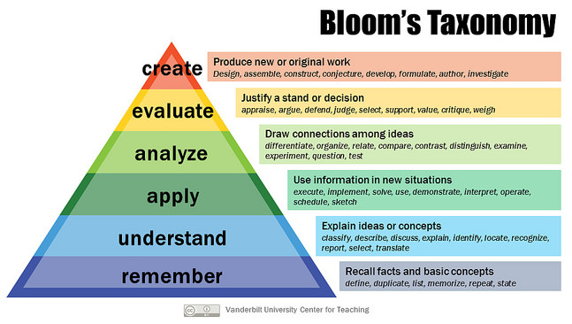
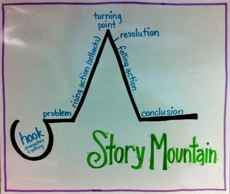

## What is a case study?

Case studies have a long history in fields such as business, law, and medicine. They are relative newcomers to sustainability and environmental education, but their use is growing. Because case studies are used in such diverse fields, they come in many different formats and styles. However, all share several important characteristics:

1. Case studies, at their most basic level, are stories. Each story is an account of a real problem, issue, or decision *(Rotterdam School of Management)* faced by a person or organization.

2. That problem, issue, or decision requires some form of analysis *(S. Yaffee, pers. comm.).*

3. Case studies are typically anchored in a specific time and place.

4. Case studies connect teaching and practice, often bringing the “real world” to students who otherwise may not have access to similar situations and stakeholders.

Many authors have proposed definitions of a case study, including this simple one:

>“Case studies are stories with an educational message.” -Clyde Herreid  *(Herreid, 2007, p.xiv )*

And this more detailed one:

>“In its most distilled form, a ‘case study’ involves investigation of [a] ‘real-life phenomenon through detailed contextual analysis of a limited number of events or conditions, and their relationships.’” -Wil Burns *(Burns, 2016)*

## What forms do cases take?

The case method is inherently flexible, and so different disciplines have taken different approaches to structuring and analyzing the cases they use. Business schools often pair a moderate-length narrative with a class discussion. Some business and management schools categorize their cases as [field, library, or armchair cases](https://www.rsm.nl/fileadmin/Images_NEW/CDC/How_to_Write_a_Good_Teaching_Case.pdf). Field cases are based on field research; library cases are based on published sources; and armchair cases are based on general experience and are grounded in reality, but do not relate actual events that have occurred. We have found that students tend to respond most positively to case studies that they know to be factual accounts of real people and real events.

Other instructors, particularly in the natural sciences, have paired narratives of various lengths with a variety of [active learning techniques](http://www.crlt.umich.edu/active_learning_introduction). Clyde Herreid at the University of Buffalo has developed a [comprehensive classification scheme](http://sciencecases.lib.buffalo.edu/cs/collection/method.asp) for the case studies produced by his institution’s case center.

Keep in mind that the learning modules you create on Gala do not need to conform to these frameworks. Use them to the extent that you find helpful and feel free to experiment to find what works best for you. Browse through the cases on Gala to get an idea of the range of different styles on display.

## The first steps in planning a case

Getting from a rough idea to a tightly-written case study can feel like a daunting task. The steps listed here will help you to break the job down into manageable pieces. 

### Write a “takeaway” statement

Start by asking yourself why you are writing a case study: Maybe you have research that you would like others to understand, want to teach a quantitative method in a real-world context, or would like readers to engage with multiple perspectives. Maybe something else entirely.

Write down, in a simply worded sentence or two, what should a reader take away from your case study?

Here are some example statements from cases on Gala:

> “Understand the impacts of a new technology. How to best design a technology to minimize negative impacts in the future--thinking through social consequences, economic and environmental impacts.”

> “Protected area decision making is highly complex. Choosing best practices for protected area enforcement does not have a clear cut, straightforward answer but requires balancing often opposing beliefs and expectations from key groups.”

> “[I want to] share a framework for how a post-industrial city could revitalize communities and create jobs through urban wood, which has been seen as a waste stream but is now being turned into something useful and beautiful.”

This takeaway statemen should give you a general idea of what you want to accomplish with your case, from there you can get more specific by writing learning objectives.

### Write Learning Objectives

Learning objectives state what someone should know or be able to do at the end of a course or a lesson. They are generally learner centered, measurable, and specific. By specific, we mean that the objectives use action verbs and articulate components of larger processes.

Consider the following examples:

| **Bad Learning Objective**                                   | **Better Learning Objective**                                |
| ------------------------------------------------------------ | ------------------------------------------------------------ |
| Students will be introduced to the history of sustainable development. *(Not learner centered)* | Students will be able to identify the major historical milestones in the history of sustainable development. |
| Learn about the   controversy surrounding the culling of deer. *(Vague)* | Identify stakeholders and their competing perspectives surrounding the culling of deer. |
| Navigate SPSS   statistical software. *(Vague, hard to measure)* | Correctly enter data and conduct analyses in SPSS including t-test, ANOVA, chi-square, and regression. |
| Be given opportunities to critically analyze policies. *(Not learner centered, vague)* | Critique a policy by identifying and evaluating the impact of both intentional and unintended consequences, formulate possible solutions, and argue a case for the best solution. |

It can be helpful to think about learning objectives in terms of the type of thinking you want a learner to practice. Bloom's Taxonomy is one common framework for organizing the difficulty of various cognitive processes.

Cognitive tasks get progressively more challenging moving up the pyramid. The figure above also lists verbs that are often associated with learning objectives at a particular level.

As you research and outline your case you may find that your priorities change. It’s fine to modify your learning objectives as the case comes to life, but plan to and refer to them often as you make decisions about how your case comes together. Your takeaway statement and learning objectives are your guiding star as you put together the case. With each decision about case structure, setting, activities, and multimedia, consider whether your choices will help achieve the objectives you have laid out.

## Researching for a case

Because cases are anchored in a specific time and place and provide the opportunity for students to learn in a real world context you will need to provide this context in a way that is both factually accurate and interesting. Depending on the form of your case and your objectives it may be important to:

- Provide historical context for a scenario.
- Represent a range of perspectives on an issue.
- Take extra initiative to understand marginalized perspectives or challenge a dominant narrative.
- Convincingly represent real-life actors.
- Create an engaged-learning exercise that mimics the way that problems are solved by practitioners in the field.

Given these needs, and keeping in mind your learning objectives, what information do you need to find? Who should you talk to? Take a moment to jot down some ideas.

Next we will walk through about the different components of a case. As you begin to think about how your case will take shape, revisit and revise this list of research needs.

## The components of a case

What follows are a series of options and ideas to consider as you plan and write your case. You will have choices to make about the kind of structure you want your case to take, what narrative devices to employ, what multimedia to include, and how to incorporate engaged learning. Examples and best practices have been included where appropriate.

These are the building blocks to play with as you work to construct an experience that fulfulls the learning objectives you set earlier. Familiarize yourself with these components now and feel free to return to this list as you begin writing.

### Structure

Storytelling is deeply engrained in human culture, and evidence indicates that conveying information in story format aids cognitive processing and retention (ElShafie, 2018). When you sit down to write the text of your case study, it may help to recall the most basic organization for a story, which is sometimes presented as Story Mountain.

As a case study, it might look something like this:

**Introduction**:

- Set the scene
- Introduce protagonist/decision maker
- Introduce decision or question

**Background**:

- Provide information necessary to understand the case (technical, historical, etc.)

**Body**:

- Lay out parameters of the problem
- How did we get here (to this problem)?
- Introduce stakeholders, perspectives, complicating factors
- Analyze possible solutions

**Conclusion**:

- Return to the problem
- Reflect on information in case study
- Pose decision or question again

However, there is no one right way to structure a case study. How you organize the information will be dictated by what you want to accomplish and the information that you have. For some additional ideas about how to structure stories, read [“My Kingdom for Some Structure"](https://transom.org/2013/my-kingdom-for-some-structure/) and [“Understanding Story Structure with ‘The Three Little Pigs’.”](https://training.npr.org/2015/03/24/understanding-story-structure-with-the-three-little-pigs/)

Here are some different examples of structure in cases on Gala:

- [Urine Diverting Toilets](https://www.learngala.com/cases/urine-diverting-toilets/) – The case simulates an email exchange between an engineering professor and a housing director about installing urine diverting toilets. The two go back and forth about benefits and potential drawbacks. Students then take on a stakeholder role, with each student elaborating the concerns of their stakeholder and coming to a decision.

- [Assembling Our Transportation Future](https://www.learngala.com/cases/model-t) – The case begins by summarizing some of the positive and negative impacts brought about by the proliferation of the automobile in the United States. It then asks the reader _“If we could only advocate for a single strategy in the formative years of the automobile age, what would we choose?”_ and introduces a fictional protagonist working at the dawn of the automobile age who can create a policy to assuage some of the worst effects of its introduction. From there the case progresses through history, discussing key milestones in planning, transportation, and urban development, before discussing some alternatives, each with their own limitations. Readers then must decide on a policy to implement.

- [Management of Three Lakes in Yunnan, China](https://www.learngala.com/cases/management-of-three-lakes-in-yunnan-china/) – The case introduces a protagonist, a student from Michigan travelling to Yunnan, China to study restoration efforts in the Three Lakes region there. The case authors provide background on the region, from physical landscape, cultural, and land use perspectives, then describe the current directive to restore the lakes in the context of the district’s five year plan. Readers are then asked to provide solutions to meet the directive, drawing on their own knowledge and background. The second half of the case discusses the way the directive was really implemented in Yunnan. Students are then asked to complete a jigsaw exercise on the different solutions before providing their own recommendation.

### Narrative tools

#### Signposting

Signposting lets readers know early on why they are reading your case and how they will be expected to engage with it. How frequently and directly you signpost will depend on your audience. Graduate students or advanced undergraduates tend to be better at finding their own way through a text but, unless you have a pedagogical reason to be obscure, why not tell your readers why they’re here from the beginning?

A common way to do this in a decision-case is to quickly set up a decision in the first section of a case, stating the decision that will need to be made at the end of that section before getting into background and competing perspectives. [Wolf Wars](https://www.learngala.com/cases/mi-wolves/), a case about whether Michigan’s Natural Resources Council Chair should recommend allowing a wolf hunt, uses this pattern, getting right to the point at the end of the first page:

> Now, on the eve of this momentous decision, Richardson reflected on his options. Should he heed the calls of anti-hunt advocates and some scientists that wolves should continue to be fully protected? Should he allow the public hunt to proceed, or encourage the DNR to find other ways to control the population? How might conflicts between wolves and humans be managed most effectively? What are the ramifications of the different decisions for the stakeholders involved? Richardson returned to his reading with these questions weighing heavily on his mind.

Cases that aren’t based around a decision may do this differently. As you’re planning your case, think about how you expect readers to engage with the material you are presenting. How will you indicate your expectations?

#### Tense

We have found that it is typically best to use a past tense, third-person point of view. Although writing a case study in present tense might make it feel more immediate and relevant, it can also make the case study feel dated. Writing in a third person point of view is easiest for most people, although sometimes first person can work. Second person point of view tends to sound like a *Choose Your Own Adventure* book.

#### Protagonists and other characters

You don’t have to include a protagonist in your case study but there are good reasons to, whether this central character is an individual or organization (for decision-cases it’s a necessity!):

- A central actor can give a situation a human face and provide an entrypoint for readers, allowing them to picture themselves facing the challenge you present.
- Having a central figure can make it easier to write a clearer, tighter, narrative. As information is revealed to the protagonist it is also revealed to the reader. The inner monologue of a protagonist can also be helpful for signposting. 
- Often the protagonist at the center of the case must grapple with having incomplete information, making any kind of definitive solution elusive, reflecting real-world constraints.

When researching a case it is often useful to conduct interviews and draw from these interviews to build out characters. Working with real people as “characters” can be delicate to navigate. Building a working relationship with someone you are writing into your case can be a good way to understand their situation, but it can also make it difficult to establish critical distance.

If placing the reader in the shoes of a protagonist proves difficult, or undesirable, another useful device is to position the reader as an advisor who must draw conclusions from the information provided in order to assist a decision-maker.

#### Fictionalization

Realism is valuable in cases but there are some legitimate reasons to fictionalize aspects of a case, which generally boil down to:

1. Pedagogical concerns – To better set up a question or problem by shifting a decision in time, simplifying a situation, or posing a hypothetical. 

2. Political concerns – To model an actor off of a real person who you don’t have access to or consent from, or address a sensitive topic carefully.

It’s important to be forthright about what details have been changed (some cases even include a statement describing details that have been altered). Keep in mind that if your case is published on Gala, others may stumble upon it or want to use it in their teaching. Avoid straying from reality unless you have a good reason to!

#### Dialogue

When implemented well, dialogue (or the inner monologue of a protagonist character) can connect readers to what actors or decision makers are thinking and feeling. When implemented poorly it can feel clunky and immersion-breaking. [Good dialogue](https://nybookeditors.com/2017/05/your-guide-to-writing-better-dialogue/) is much harder to write than most writers assume so tread carefully and intentionally: ask yourself, “what is this piece of dialogue adding to the case?”

Here are some examples of dialogue from cases on Gala. In both cases dialogue was informed by interviews conducted while researching the case:

The [Souring Climate](https://www.learngala.com/cases/michigan-cherry-growers/) case uses monologue and occasional dialogue to convey a sense of cherry grower’s deep ties to the land and an agricultural way of life:
> You had to be okay with risk in this business, Frank thought, and, in spite of the risk, there were plenty of cherry stands, both on and off the Leelanau Peninsula. “There’s money in growing tarts, otherwise we’d be doing something else up here” he remembered his dad saying. “But it’s not for everybody.” It was the life for him though, Frank thought–turning back away from the bay and towards the festival stands purveying all manner of cherry goods—and a pretty one at that.

The [Guns or GPS Units?](https://www.learngala.com/cases/guns-or-gps/) Case uses dialogue to convey a sense of the circumstances faced by rangers working to deter poaching:
>“Sema Denis, what’s going on?” Josh inquired urgently. The phone connection at Mugie Ranch, a 200–square-kilometer private conservancy located in the shadow of Mt. Kenya on the border of Samburu and Laikipia counties, was spotty at best, and Josh struggled to hear the response.
>
> “Tembo waliokufa. A dead elephant. Found in the southern part of the conservancy. Shot four times, and the tusks are gone.”

### Multimedia and External Resources

#### Multimedia on Gala

You can integrate multimedia into your case on Gala with “edgenotes.” Edgenotes can be links to outside resources or multimedia that you create. The easiest way to understand how edgnotes work is browse some Gala cases, read our [quickstart guide](https://docs.learngala.com/docs/authoring-embedding-media.html), and create a new case and start experimenting on your own.

#### The role of Edgenotes

Multimedia can play several roles in a case:

- _Presenting information through multiple channels_ – Some [educational psychologists suggest](https://faculty.washington.edu/farkas/WDFR/MayerMoreno9WaysToReduceCognitiveLoad.pdf) that presenting information through audio and visual channels can help reduce cognitive load and improve comprehension. [_Principles of “e-learning”_](https://en.wikipedia.org/wiki/E-learning_(theory)) may be of further interest to authors working with multimedia.
- _Providing supplemental information_ – Edgenotes can give readers the opportunity to explore a topic further. You may also want to link useful resources for readers who may lack a background in a certain area. It is helpful to indicate to readers when an edgenote is optional (“learn more about..”).
- _Giving context and realism_ – Our understanding of our world is increasingly mediated through video, audio, images, and even social media posts. You can use pieces of the digital trail left by unfolding events to help readers ground your case in the real world. For example: [Green vs. Grey](https://www.learngala.com/cases/washtenaw-county-rain-gardens), a case about green infrastructure in Ann Arbor, MI, uses articles from a local news outlet about flooding to set the stage for an infrastructure decision, and a podcast featuring interviews with neighbors who have been affected by flooding, as well as the workers who administer the County’s rain garden program.
- _Using the best tool for the job_ – You will find that some modes of presenting information are just better suited to a given task. An image or video can help readers picture [a controversial dam to be removed](https://www.learngala.com/cases/maple-river-dam/1), a map can show [where a threatened lake](https://www.learngala.com/cases/management-of-three-lakes-in-yunnan-china/2)  sits in relation to surrounding urban development, and a chart can help a reader draw conclusions from lots of data points. Just remember to [include accessible captions](https://www.learngala.com/cases/management-of-three-lakes-in-yunnan-china/2)!
- _Creating interactivity_ – Edgenotes can also create opportunities for reader interaction. You can ask readers to draw conclusions from interactive charts, maps, articles and RShiny apps.

As you plan your case, write down any ideas you have for multimedia elements that might help you meet your learning objectives. Any field visits or interviews you conduct may be good opportunities to gather images, audio, or video.

#### Navigating Copyright

You will need to be mindful of copyright concerns. U.S. copyright law is complex, and this document is not intended as a source of legal information. The University of Michigan Library has a somewhat lengthy [copyright guide](https://guides.lib.umich.edu/copyrightbasics) that provides a helpful introduction to copyright, including [fair use](https://guides.lib.umich.edu/c.php?g=283105&p=6687646), which can be challenging to navigate.

In general:

- Linking to sources (such as a website or YouTube video, as opposed to reproducing within your case study) is okay.
- When embedding images, look for materials in the [public domain](https://fairuse.stanford.edu/overview/public-domain/welcome/) or with a [Creative Commons](https://search.creativecommons.org/) license. Good sources of images include:
    - Google image search, using the Tools menu to select Usage Rights “labeled for noncommercial reuse” (though be aware that this tool is not foolproof)
    - [Wikimedia Commons](https://commons.wikimedia.org/)
    - [Creative Commons on Flickr](https://www.flickr.com/creativecommons/)
    - Government sources, which are in the public domain by default (but be aware that some government publications reproduce copyrighted materials with permission.)
- Reproducing figures from academic journals usually requires permission, however, you can recreate your own figures from data–which are not subject to copyright–and using figures from [an open-access journal](https://support.nature.com/en/support/solutions/articles/6000217050-use-of-an-open-access-figure-or-table#:~:text=Reproduction%20of%20figures%20or%20tables,identified%20as%20the%20original%20publisher) is usually okay.

### Engaged Learning  

Your learning objectives will also help you determine an appropriate engaged learning exercise (or set of exercises) for your case.
 The idea of a teachable unit *(Handelsman et al., 2007)* connects learning objectives to assignments (engaged learning exercises) and assessments.

| **Learning Objective**                      | **Assignment**                                     | **Assessment**                                               |
| ------------------------------------------- | -------------------------------------------------- | ------------------------------------------------------------ |
| What should students know or be able to do? | How will students practice what they have learned? | How will the instructor know that the students have learned it? |

The University of Michigan Center for Research on Learning and Teaching [defines engaged learning](http://www.crlt.umich.edu/category/tags/no-parent/engaged-learning) as “providing students with opportunities for practice in unscripted, authentic settings, where stakeholders (including the students themselves) are invested in the outcome.” Engaged learning exercises should give students meaningful practice that will allow them to meet the learning objectives. Building an engaged learning exercise from an [active learning strategy](http://crlt.umich.edu/sites/default/files/instructor_resources/how_can_you_incorporate_active_learning.pdf) is a good way to include practice in a case study. 

Thinking about your intended audience will help you determine what level of complexity and time commitment is appropriate for the engaged learning components of your case. Simple pauses for reflection may be appropriate for a case intended for public education or to introduce a topic to a class, whereas a more complex and time consuming activity, such as a modelling exercise or a stakeholder roleplay, may take up multiple class periods. Some case authors include teaching guides with their cases that detail how a case fits into a teachable unit.

Once you have decided on the engaged learning exercise, you can design an assessment to gauge whether learners have met your learning objectives. Note that the engaged learning exercise and the assessment can be the same thing. If you assign learners to write an essay about a topic, and then grade that essay, the essay serves as both practice and an indication of learning. Similarly, a case study can allow learners to practice a skill, and the instructor can use the activities associated with a case study to assess whether the learning objectives have been met.