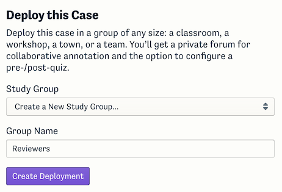
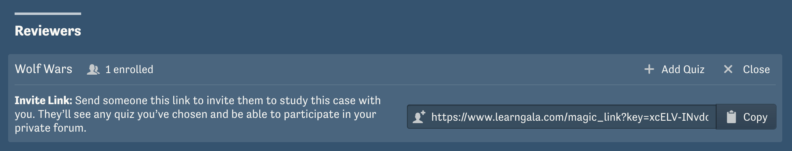

Once you’ve finished writing your narrative and embedding media elements, there are a few things you may want to do before hitting publish.

## Invite reviewers to read through your case

You can deploy your case without publishing it in order to receive feedback from reviewers.
In your case’s toolbar when you’re not in edit mode, click “Deploy this Case.”

Create a new study group for your reviewers—you might call it _Reviewers_.

Then, from your “Deployments” index, you can copy the invite link and send it to anyone you wish.

That link will allow those who follow it to read your case before it is published, and it will add them to a private forum where they can comment on your case.

This is also the way to use a case while keeping it private.
You don’t ever _have_ to publish your case.

## Pick a easy-to-remember URL

When your case is first created, its URL will end in a bunch of random letters and numbers.
Before you publish it, you may wish to make that more memorable.
Change your case’s URL slug on its “Case Settings” page.
URL slugs must be globally unique and are first-come-first-served.

## Create a suggested assessment

When other users deploy your case, they’ll have the opportunity to create a custom pre-/post-quiz, but many people would rather use one that you suggest.
We are working on a more streamlined workflow for creating a suggested quiz, but for now this is the procedure.
Follow the instructions above to [create a review deployment](#invite-reviewers-to-read-through-your-case) and customize that quiz’s deployment with your quiz.
Send an invite link to us at hello@learnmsc.com, and we will set it as a suggested assessment for your case.

## Finally, publish

When you are satisfied with your case, you can publish it from its “Options” menu.
Even after you publish, however, you can still make changes to keep it up to date.
