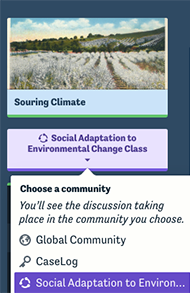
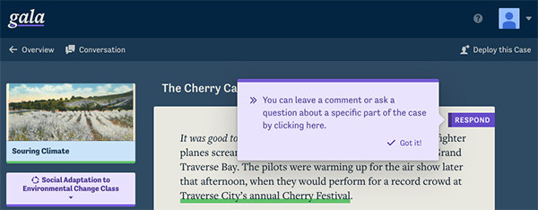
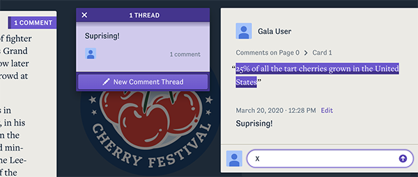

You can use Gala's discussion feature to add annotations related to a portion of the case text. 

One common way of using this feature is to ask students to ask questions or comment on portions of the text they find compelling. You can also solicit meta-commentary from experts or community members involved in the issue outlined in the case.

## Discussing a case with a study group

 While reading a case, you can select your *Active Community* from the purple drop-down menu on the left-hand side of the screen. Responses posted in the Global Community will be visible to everyone. Students enrolled in a study group (*see [Deploying a Case](./teaching-getting-started.md)*) can participate in a discussion visible only to their study group by ensuring that the name of that study group is selected in the drop-down menu.

## Posting discussion responses

To respond to a portion of the text, click the purple *Respond* button in the upper-right corner of any card. You will be prompted to select a few words from the text (highlight them with the cursor).

After selecting the text you want to respond to, click *Respond Here*. A comment box will open, showing the text you highlighted and prompting you to write a reply. You can even reply with an attachement.

Sections of the text with responses are underlined in purple. You can see responses by clicking on the underlined text, or clicking on the respond button. If a card has responses, the number of responses will be indicated there. You can reply to existing threads by clicking on them.

