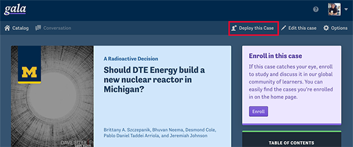
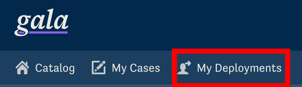
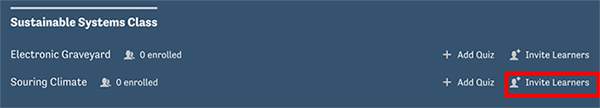
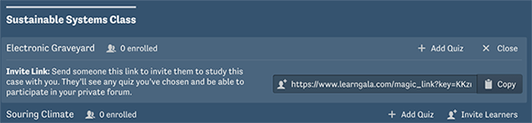
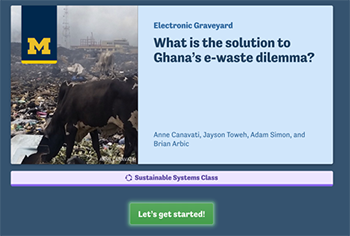
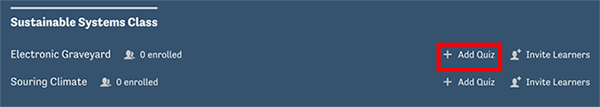
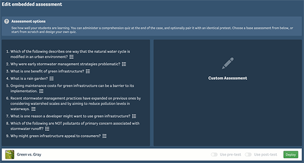
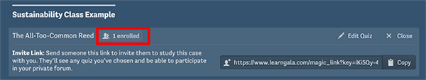
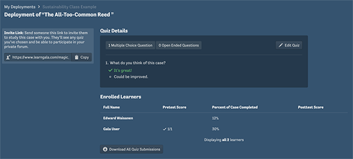

You can assign cases that you create or discover on Gala to a group of learners. We call this “deploying” a case.

## Create a deployment link
To deploy a case, navigate to the summary page of any case and click the ‘Deploy this case’ button in the upper-right-hand corner.

*(If you want to assign a case you have created, but aren’t ready to make it publicly available,you can still deploy it without publishing. In your case’s toolbar, when you’re not in edit mode, follow the same steps outlined here.)*

Next you will be prompted to select an existing study group for the deployment or create a new one.

After choosing or creating a study group the group will be added to your ‘My Deployments’ page. You can access your deployments anytime by clicking the ‘My Deployments’ button on the toolbar.

Your study group will appear on the ‘My Deployments’ page, along with any assigned cases. You can invite learners to study a case by clicking ‘Invite Learners.’

Copy the invite link and share it with learners to invite them to study the case.

(*Note that you must share a link for each case you want to assign and that anyone with this link can enroll in your study group.*)

  
After following the Invite link learners will see the following screen. After clicking the ‘Let’s get started!’ button, they will be enrolled in the case as a member of the study group you have specified.

Students can see their enrolled-cases in the left-hand sidebar when signed-in to Gala.

## Quizzes

You can optionally assign a quiz to your study group from the *'My Deployments'* page. Your case deployment will not include a quiz assignment unless you add one.

Some case authors have created default quizzes to accompany their cases. You can choose to deploy your case with the default quiz, add questions to this default quiz, or create an entirely custom assessment.

Quiz questions may be open-ended or multiple-choice. You may also specify whether you want to assign the quiz as a pre-test, post-test, or both.

## Deployment Insights

Once learners have enrolled in your deployed case you can see an overview of your deployment from your ‘*My Deployments*’ page by clicking the ‘*[#] enrolled*’ button.

From here you can see a list of enrolled learners and review their progress in the case, see quiz results, and edit assigned quizzes or download quiz submissions.

