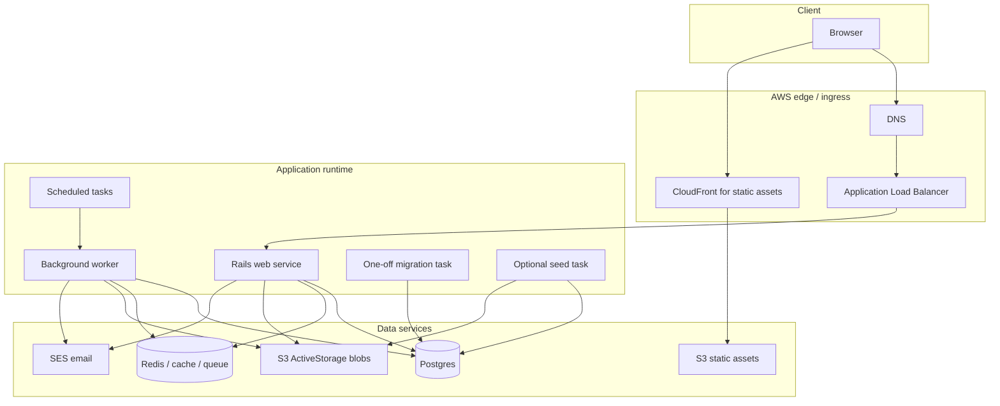
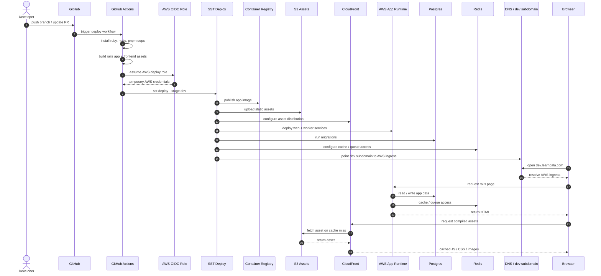
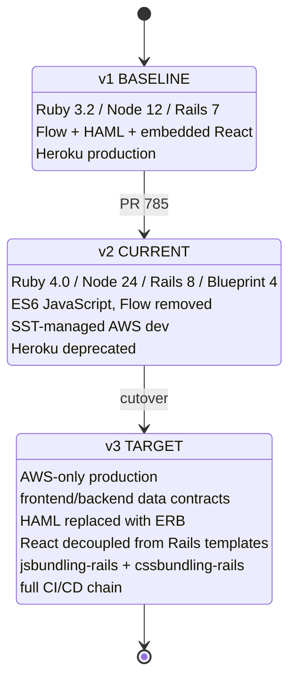

## Summary

This PR delivers runtime modernization and AWS infrastructure foundation for Gala.

Scope:
- Rails, Ruby, Node, and frontend build upgrade
- Flow removal from JavaScript codebase
- AWS / SST infrastructure with preserved Heroku support
- Route-level visual regression tooling

## Runtime and platform changes

| Area | Before | After |
|---|---:|---:|
| Ruby | 3.2.x | 4.0.x |
| Rails | 7.x | 8.x |
| Node | 12.x | 24.x |
| Package manager | yarn | pnpm |
| JS bundling | webpacker | shakapacker / webpack 5 |
| UI baseline | Blueprint 2 | Blueprint 4 |
| Type system | Flow | ES6 JavaScript |

## Delivery

Preview URL:

http://galawebloadbala-chdmccbn-1073735116.us-west-2.elb.amazonaws.com/

Related:

- #739

## Status board

| Status | Toggle | Workstream | Criteria to flip |
|---|---|---|---|
| Done | [x] | Upgrade runtime baselines | `.ruby-version`, `.node-version`, `mise.toml`, `Gemfile`, and `package.json` align on the new baseline |
| Done | [x] | Move package management to pnpm | `pnpm-lock.yaml` is present and install/build paths use pnpm |
| Done | [x] | Preserve local development | Docker Compose boots Rails, Postgres, and Redis locally |
| Done | [x] | Update local setup docs | README reflects the modern Ruby, Node, pnpm, and Docker setup |
| Done | [x] | Add AWS foundation | SST app exists under `infra/` with web, worker, migration, seed, and scheduled task scaffolding |
| Done | [x] | Preserve Heroku support | Heroku config remains present while AWS migration work continues |
| Done | [x] | Add AWS deploy workflow | GitHub Actions deploy workflow exists with AWS OIDC auth |
| Done | [x] | Add visual regression scaffolding | Playwright config, route helpers, and screenshot baseline structure exist |
| Doing | [ ] | Enforce TLS-only traffic | HTTP is explicitly redirected to HTTPS at ingress, or Rails `force_ssl` is accepted as the final control |
| Doing | [ ] | Verify AWS production acceptance | Preview URL is reachable and web, worker, migrations, assets, and seed flow pass end to end |
| Doing | [ ] | Expand route parity coverage | Route inventory is generated from Rails routes output or equivalent instead of relying only on curated routes |
| Doing | [ ] | Stabilize upgraded UI routes | High-value public and authenticated routes pass visual parity checks |
| Todo | [ ] | Reduce review entropy | Generated artifacts, reports, local caches, and planning-only files are removed or moved to follow-up PRs |
| Todo | [ ] | Define hot-route caching strategy | `/catalog` and other sluggish routes have documented page, partial, and data-cache strategies |
| Todo | [ ] | Prove CSRF-safe CDN behavior | CDN caching does not break sessions, forms, CSRF tokens, or authenticated views |
| Todo | [ ] | Refresh learner-facing entry routes | Homepage and catalog UX changes are scoped separately from platform-risk work |
| Todo | [ ] | Finalize cutover runbook | AWS rollout, rollback, DB, assets, worker, and DNS steps are documented |

## Review approach

Please review this PR in slices:

1. runtime and package-manager baseline
2. local Docker and DB restore flow
3. Flow removal and JavaScript cleanup
4. UI parity and route stabilization
5. Playwright visual-regression scaffolding
6. AWS / SST infrastructure
7. GitHub deploy workflow
8. docs, planning artifacts, and cleanup

## Reducing the change set

This PR currently mixes application upgrades, infrastructure, CI, visual testing, docs, and generated artifacts.

To make review and rollback safer, reduce the change set in two ways.

### Immediate cleanup

Remove files that do not affect runtime behavior:

- `.planning/**`
- `playwright-report/**`
- `test-results/**`
- `.playwright-browsers/**`
- `.pnpm-store/**`
- architecture PDFs and generated review artifacts

These can move to a docs-only follow-up PR if they are still useful.

### Architecture 

## Risk notes

| Risk | Mitigation |
|---|---|
| Large change set is hard to review | Split or remove generated artifacts before final review |
| AWS path may not be fully production-ready | Keep Heroku support active until AWS acceptance passes |
| UI regressions from Rails / Blueprint / bundler upgrades | Use route-level Playwright visual checks |
| CDN caching can break dynamic Rails behavior | Prove CSRF, session, and authenticated route behavior before caching HTML |
| TLS behavior may be split between ALB and Rails | Decide whether ingress redirect or Rails `force_ssl` is the final control |

## Merge criteria

This PR should not be considered production cutover-ready until:

- [x] AWS preview URL is consistently reachable
- [ ] TLS behavior is verified
- [ ] migrations run cleanly
- [ ] workers run cleanly
- [ ] assets build and serve correctly
- [ ] critical public routes pass visual checks
- [ ] critical authenticated routes pass visual checks
- [ ] Heroku compatibility is preserved or an explicit cutover decision is made
- [ ] generated artifacts and local caches are removed from the review set
- [ ] cutover and rollback steps are documented

## Deployment sequence

## State transition view

## Roadmap checklist

| Version | Status | Scope | Exit criteria |
|---|---|---|---|
| v1 | BASELINE | Heroku-hosted Gala production | Stable reference for parity checks |
| v2 | CURRENT | Runtime modernization, AWS dev infra, UI parity, Flow removal, GitHub Actions deploy | AWS dev usable, v1 parity verified, Heroku deprecated |
| v3 | TARGET | AWS-only production, data contracts, ERB migration, React decoupling, jsbundling/cssbundling, full CI/CD | CI/CD complete, AWS is sole production runtime |